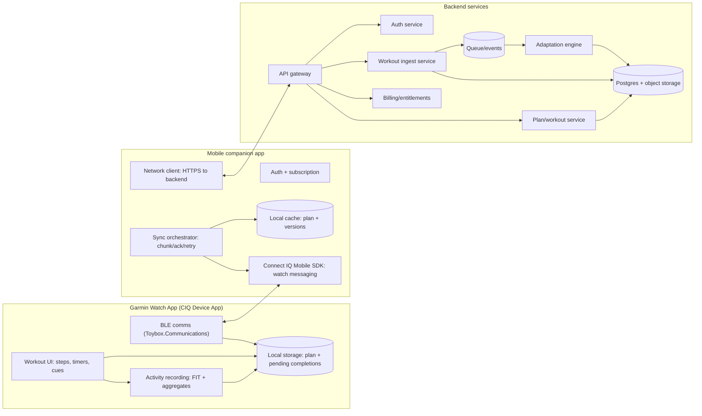
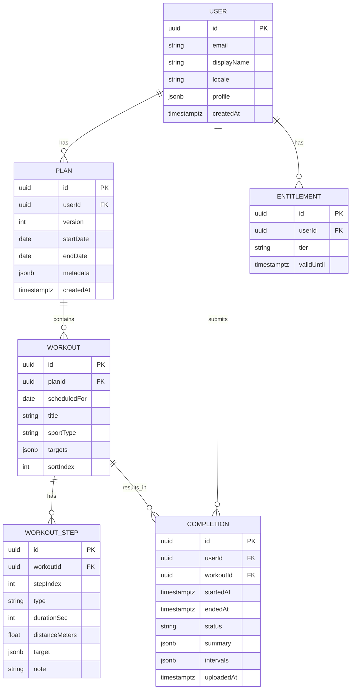
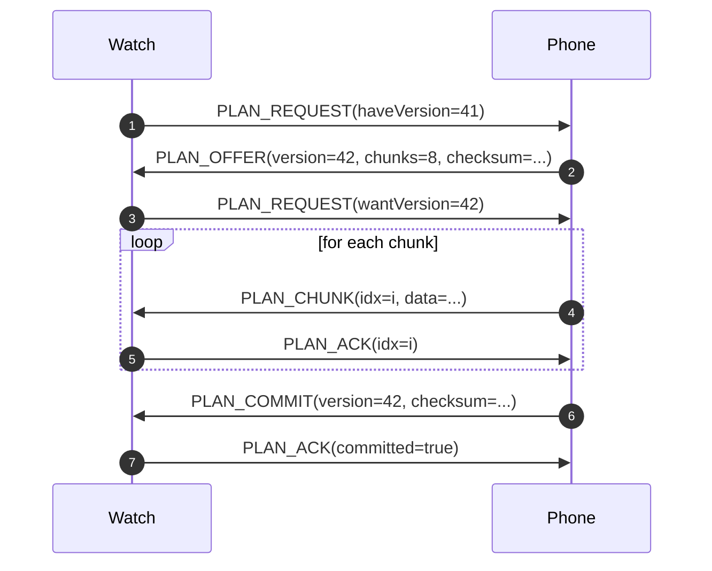
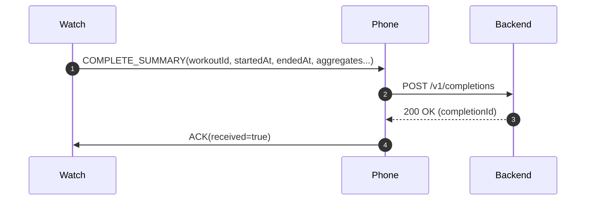
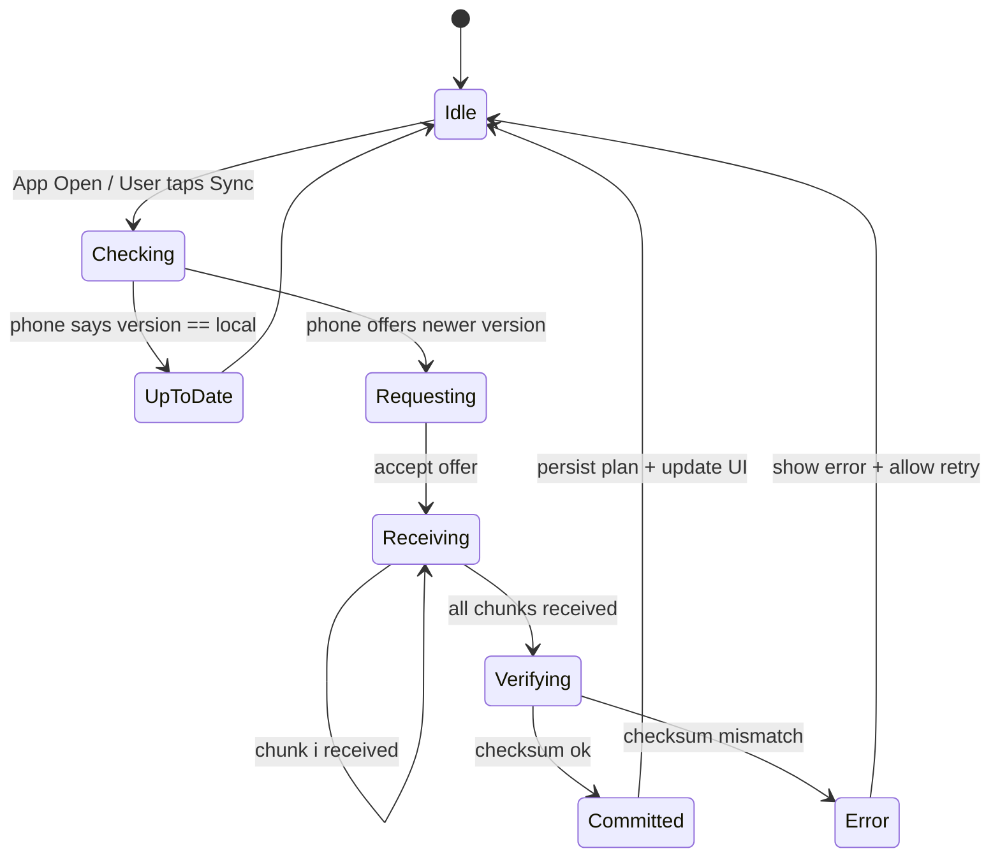
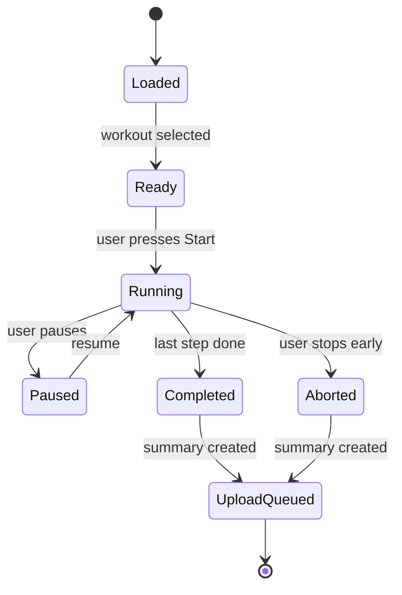
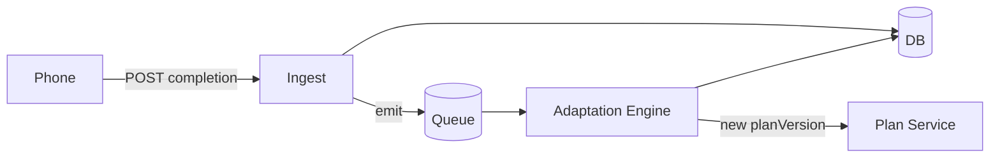
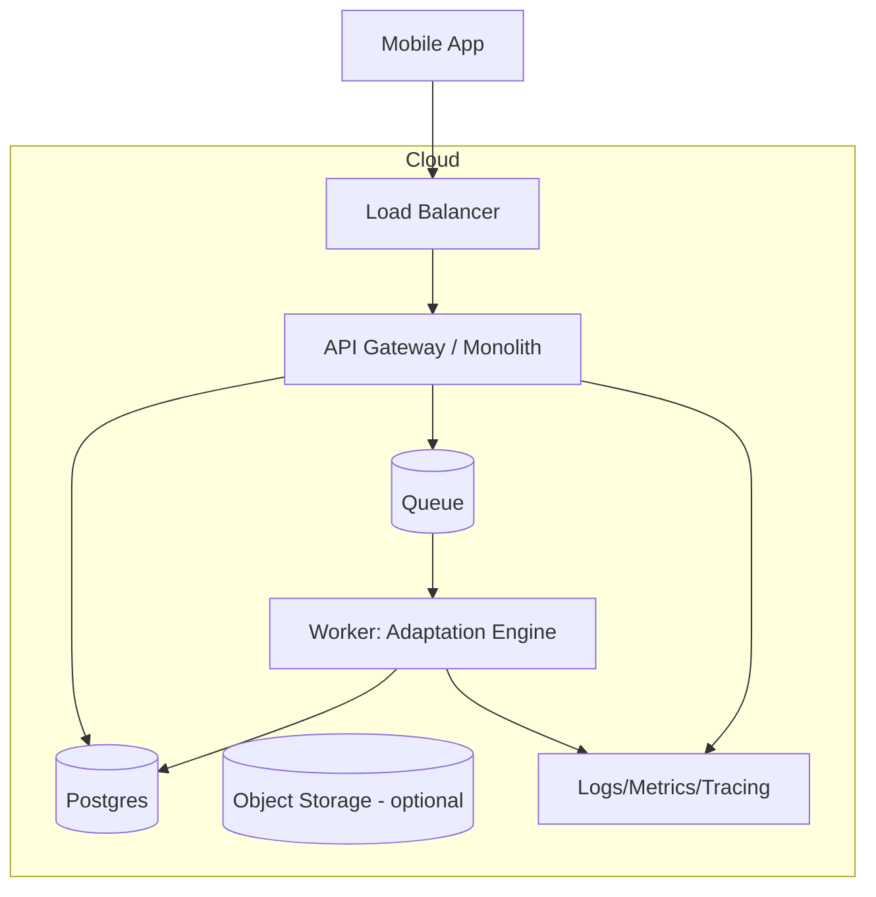

Below is a production-style **System Architecture Doc** for the “Adaptive AI Training Platform for Garmin” with **services, APIs, sync protocol, and message flows**, plus **MermaidJS diagrams** you can paste into docs.

---

# System Architecture Document

## Adaptive Training Platform for Garmin (FR245 Music)

### Status

Draft v0.1 (implementation-ready)

### Goals

* Deliver adaptive workouts from server → phone → watch
* Execute workouts on watch with step guidance + recording
* Sync completion summaries back to server
* Maintain reliability under intermittent BLE connectivity
* Keep watch payloads small and operations battery-friendly

### Non-goals

* Real-time streaming of high-frequency sensor data to server
* Replacing Garmin Connect cloud (optional future integration)
* “Always-on” background watch syncing (not reliable/portable)

---

# 1) Problem & Solution Overview

## Problem

Garmin devices collect great data but the user still lacks:

* a personalized “what do I do today?” answer
* adaptive progression tuned to their response and recovery
* a smooth loop between coaching (human/AI) and execution (watch)

## Solution

A closed-loop training system:

1. **Server** generates plan/workout (human coach + algorithm/AI).
2. **Phone** fetches plan, caches it, and syncs to watch on demand.
3. **Watch** runs workout UI + records session.
4. **Watch → Phone → Server** sends completion summary.
5. **Server** adapts next workout.

---

# 2) High-level Architecture



---

# 3) Core Components

## 3.1 Watch App (Connect IQ Device App)

Responsibilities:

* Display workout steps, cues, timers
* Record session (at least summary; optionally FIT activity)
* Maintain local plan cache + pending completion queue
* Sync on user action (“Sync”) and on app open

Key constraints:

* Limited memory/CPU
* BLE messaging is lossy; must be chunked + acked
* Background behavior is limited; assume foreground UX

## 3.2 Phone Companion

Responsibilities:

* Authenticate user and enforce subscription/entitlements
* Fetch latest plan from server, cache by version
* Transfer plan to watch using robust protocol
* Receive completion summaries from watch and upload to server
* Handle offline/poor connectivity

## 3.3 Backend

Responsibilities:

* Store users, plans, workouts, completions
* Generate and version plans
* Ingest completion summaries and trigger adaptation
* Provide admin/coach tooling later (optional)

---

# 4) Data Model (conceptual)



---

# 5) APIs (Backend)

## 5.1 Auth

### `POST /v1/auth/login`

* Input: `{ email, password | oauthToken }`
* Output: `{ accessToken, refreshToken, user }`

### `POST /v1/auth/refresh`

* Input: `{ refreshToken }`
* Output: `{ accessToken }`

## 5.2 Plans & Workouts

### `GET /v1/plan/latest`

* Auth required
* Output:

```json
{
  "planVersion": 42,
  "generatedAt": "2026-02-19T15:00:00Z",
  "workouts": [
    {
      "workoutId": "uuid",
      "scheduledFor": "2026-02-20",
      "title": "Intervals: 6x2min",
      "sportType": "RUN",
      "steps": [ /* compact steps */ ]
    }
  ],
  "checksum": "sha256:..."
}
```

### `GET /v1/workout/:id`

* Full workout detail (if you keep `/plan/latest` compact)

## 5.3 Completion ingest

### `POST /v1/completions`

* Input: completion summary + interval aggregates (not raw sensor stream)
* Output: `{ ok: true, completionId }`

## 5.4 Entitlements

### `GET /v1/entitlements`

* Output: `{ tier, validUntil, features: {...} }`

---

# 6) Watch ↔ Phone Sync Protocol (BLE)

Design goals:

* Works with intermittent connectivity
* Minimizes payload size and watch memory spikes
* Supports incremental updates and retries
* Ensures integrity (checksum + version)

## 6.1 Message envelope

All messages are JSON (or MessagePack later), wrapped like:

```json
{
  "v": 1,
  "type": "PLAN_OFFER|PLAN_REQUEST|PLAN_CHUNK|PLAN_ACK|PLAN_COMMIT|COMPLETE_SUMMARY|ERROR|PING",
  "reqId": "short-id",
  "ts": 1700000000,
  "payload": { }
}
```

## 6.2 Plan sync (chunk + commit)

**Happy path**

1. Watch → Phone: `PLAN_REQUEST { haveVersion: 41 }`
2. Phone → Watch: `PLAN_OFFER { version: 42, sizeBytes, checksum, chunks }`
3. Watch → Phone: `PLAN_REQUEST { wantVersion: 42 }`
4. Phone → Watch: `PLAN_CHUNK { idx, data }` (data base64/array)
5. Watch → Phone: `PLAN_ACK { idx }` (or `NACK { idx }`)
6. After all chunks: Phone → Watch `PLAN_COMMIT { version, checksum }`
7. Watch validates checksum and responds: `PLAN_ACK { committed: true }`

**Retry rules**

* If no ACK in `T=2s`, resend chunk up to N times (e.g., 5)
* If NACK, resend that chunk immediately
* If checksum mismatch: watch clears staging and requests re-send

### Mermaid sequence



## 6.3 Completion upload (watch → phone)

Watch sends a small summary immediately, and can queue if offline.



---

# 7) State Machines

## 7.1 Watch sync state



## 7.2 Workout execution state (watch)



---

# 8) Backend Services (recommended slicing)

You can start monolith and split later, but design boundaries now.

## 8.1 API Gateway

* Routing, auth middleware, rate limiting
* Observability correlation IDs

## 8.2 Auth Service

* JWT access + refresh tokens
* Password/OAuth (future)
* Device registration tokens (optional)

## 8.3 Plan/Workout Service

* Stores plan versions
* Produces compact workout payloads for watch
* Exposes “latest plan” endpoint
* Handles plan regeneration triggers

## 8.4 Ingest Service

* Validates completion payload schema
* Idempotency keys to prevent duplicates (e.g., `completionHash`)
* Writes to DB and emits event: `completion.received`

## 8.5 Adaptation Engine

* Consumes completion events
* Updates user model (fitness/fatigue, 1RM estimates, etc.)
* Generates next workout(s)
* Bumps `planVersion`

### Event-driven adaptation diagram



---

# 9) Deployment Topology



Notes:

* Object storage is optional; use it if you decide to archive FIT files or detailed session blobs.
* Queue can be SQS/Rabbit/Kafka; start simple.

---

# 10) Reliability, Integrity, and Idempotency

## 10.1 BLE transfer

* **Chunk size**: pick conservative (e.g., 512–1024 bytes) to reduce failure
* ACK per chunk
* Staging buffer on watch (persist partial if needed)
* Commit only after checksum passes

## 10.2 Completion ingest idempotency

* Phone generates `Idempotency-Key` header: hash(workoutId + startedAt + endedAt)
* Backend stores key to prevent double writes
* Watch also stores “pending uploads” until phone ACKs

## 10.3 Offline behavior

* Watch can execute any cached workout offline
* Completion queued on watch if phone absent
* Phone queues to backend if network absent

---

# 11) Observability & Diagnostics

## Watch

* Minimal logging (ring buffer)
* Debug screen: last sync, planVersion, pending completions count
* Error codes: `BLE_TIMEOUT`, `CHECKSUM_FAIL`, `NO_PHONE`

## Phone

* Structured logs per sync session
* Export debug bundle (plan versions, last messages, retries)

## Backend

* Correlation ID from phone in every request
* Metrics:

  * sync success rate
  * completion ingest success rate
  * adaptation job time
  * plan generation failures
* Alerts:

  * spike in checksum failures (protocol regression)
  * spike in duplicate completions (idempotency issues)

---

# 12) Security & Privacy

* TLS for all phone ↔ backend traffic
* Access tokens short-lived; refresh tokens rotated
* Store minimal PII
* Provide account deletion endpoint:

  * deletes user + completions (or anonymize)
* Clearly document fitness disclaimer in ToS

---

# 13) MVP Implementation Plan (backlog view)

## Milestone 1 — “Plan appears on watch”

* Backend: `/plan/latest` returns static plan v1
* Phone: login stub + fetch plan + cache
* Watch: UI to view next workout + manual sync
* Sync protocol v1 (offer/request/chunk/commit)

## Milestone 2 — “Workout runs + summary returns”

* Watch: workout runner state machine + timers + cues
* Watch: completion summary + pending queue
* Phone: upload completion to backend + ack to watch
* Backend: `/completions` ingest

## Milestone 3 — “Adaptive loop”

* Backend: adaptation worker updates planVersion based on completion
* Phone: sees new planVersion and syncs
* Watch: “new workout available” indicator

---

# 14) Open Design Choices (make these decisions early)

1. **Record on watch as FIT or summary-only?**

   * Summary-only is easier; FIT provides better user trust (“it shows up in Garmin history”).
2. **Workout types first:** strength vs running vs hybrid

   * This heavily impacts step schema and metrics.
3. **Coach tooling:** admin web console now or later

   * You can bootstrap with database + scripts early.

---

If you want, I can generate next:

* A concrete **Workout Definition schema** (JSON Schema) for strength + running
* A **sync payload sizing plan** for FR245 constraints (how many workouts/steps fit safely)
* A starter **REST API OpenAPI spec** you can drop into codegen
* A pragmatic **adaptation algorithm v0** (rules-based) you can ship before going full ML/LLM
